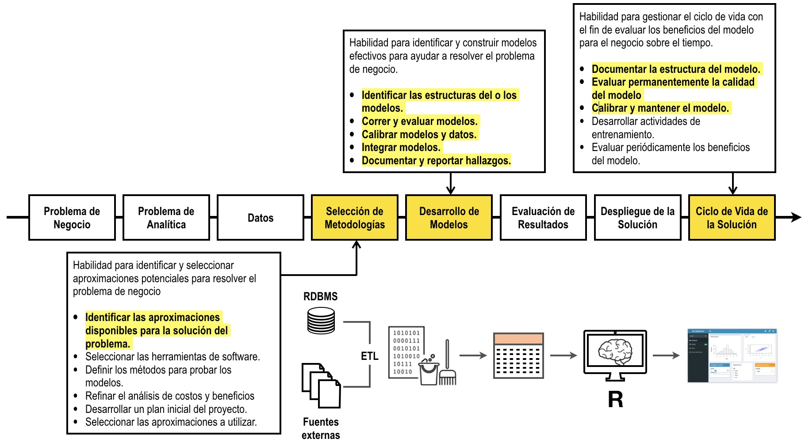

# Programación en R para analítica predictiva

Haga click [aquí](http://nbviewer.jupyter.org/github/jdvelasq/R-for-predictive-analytics/tree/master/)
para visualizar este repositorio en nbviewer.

## Descripción

La Analítica Predictiva se define como el uso de técnicas de aprendizaje estadístico y aprendizaje
de máquinas para la solución de problemas en el contexto organizacional. Dichos problemas pueden
organizarse en tres grandes grupos:

* Agrupamiento o detección de conglomerados.
* Clasificación.
* Regresión.

El siguiente grafo muestra donde encaja este tutorial en el proceso.

## Objetivos

Al finalizar este tutorial el lector debe estar en capacidad de solucionar 
diferentes tipos de problemas usando:

* Técnicas de agrupamiento.
* Técnicas de clasificación.
* Técnicas de regresión.

explicando de forma clara sus bases conceptuales e interpretando correctamente 
los resultados obtenidos.

## Requerimientos

Para realizar este tutorial usted debe cumplir con uno de los siguientes
requisitos:

* Tener instalado R.
* Tener instalados los distintos paquetes de R.
* Haber tomado el tutorial de [Estadística para Analítica](https://github.com/jdvelasq/statistics-for-analytics).

---

**Juan David Velásquez Henao**    
Universidad Nacional de Colombia, Sede Medellín  
Facultad de Minas  
Medellín, Colombia  
[LinkedIn](https://co.linkedin.com/in/juan-david-velásquez-henao-94078979), [GitHub](https://github.com/jdvelasq), [ResearchGate](https://www.researchgate.net/profile/Juan_Velasquez8)

[Licencia](https://github.com/jdvelasq/R-for-predictive-analytics/tree/master/LICENSE)

